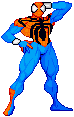
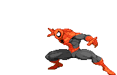

  
  <h1>Javier Chi Ortiz</h1>
  <strong>Full-Stack Engineer building products from idea to production</strong>

  *SpidySamurai* 🕷️ · 2nd Dan Shotokan karateka 🥋 · Mérida, México 🇲🇽

  [Portfolio](https://javierchiortiz.dev/en) · [LinkedIn](https://www.linkedin.com/in/javier-fernando-chi-ortiz) · [Email](mailto:javierchiortiz@gmail.com)

---

## What I’m building 

For six years, I have designed and delivered production software across SaaS, fintech, e-commerce, and data platforms. Today, my work is centered on two products with different responsibilities and the same focus on useful, reliable systems.

### [Lab2Next](https://lab2next.com)

Lab2Next is a cloud platform for clinical laboratories in Mexico. I took it from product concept to a live SaaS business as a solo engineer, and I am growing it through the practical work of operating a product that laboratories use.

### [Brania.ai](https://brania.ai)

I am part of the team building Brania.ai, an autonomous operating system for businesses. It connects context, prepares actions, and acts under human authority.

## Selected proof: Lab2Next in production

Lab2Next brings orders, patients, results, payments, and multi-branch teams into one cloud-based workflow for clinical laboratories.

- Built a multi-branch, role-based architecture around clinical workflows.
- Delivered patient results through WhatsApp with signed QR verification, without requiring an app.
- Shipped a catalog of 155+ laboratory exams validated by practicing laboratory chemists.
- Designed and operated the product end to end: frontend, backend, payments, deployment, and continuous delivery.
- Reached 50 registered users and processed 100+ exams through the live platform.

## How I work

I make trade-offs explicit and prefer systems that are easy to understand, operate, and change. I stay close to users because their feedback guides the work after launch as much as the original requirements do.

## SpidySamurai

I have practiced Shotokan karate for more than 10 years and hold a 2nd Dan black belt. Karate taught me to trust consistent practice, especially when the work gets difficult. SpidySamurai combines that discipline with the curiosity I have always liked about Spider-Man.

## Have an idea in mind? 

If you have an idea in mind, we can work together to turn it into a real product. [Tell me about it](mailto:javierchiortiz@gmail.com).

---

  

